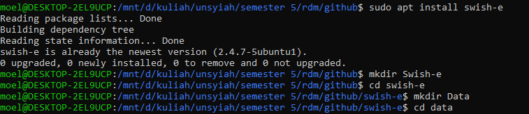
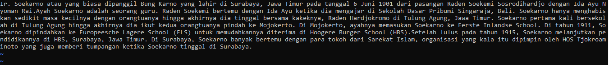
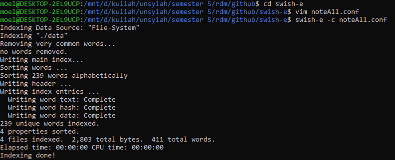
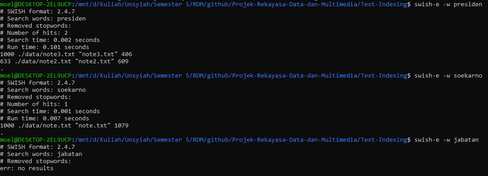
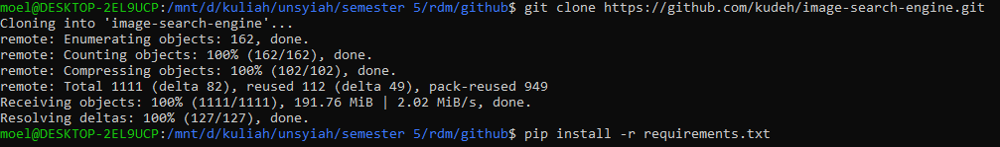
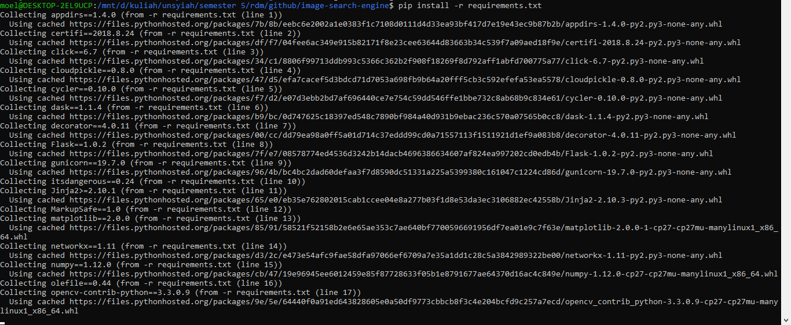
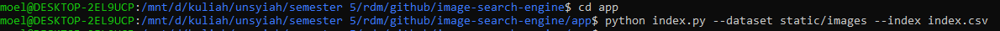
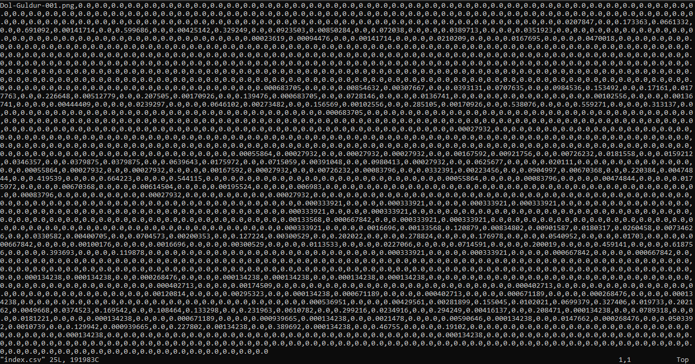
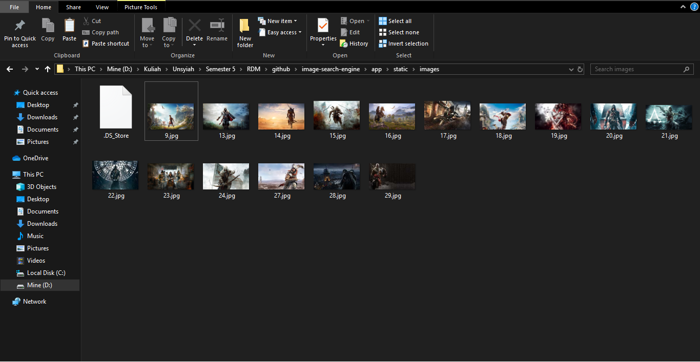
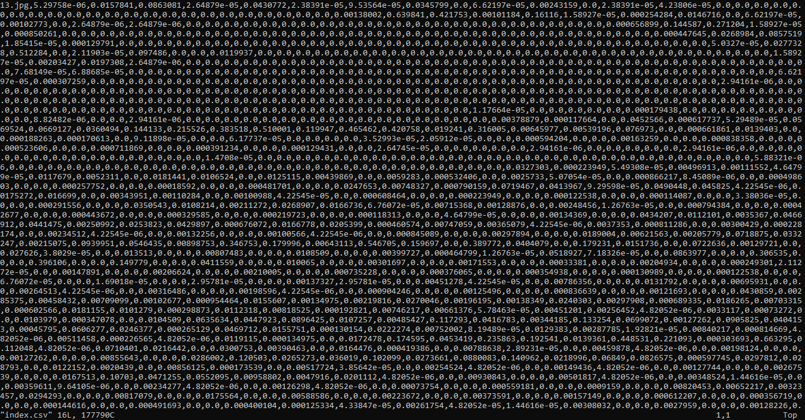

## Projek-Rekayasa-Data-dan-Multimedia

To Complete RDM task….

Text: Indexing Text and Image

A. Text Indexing:
- Download Swish-e (swishe.org/download/).
- Open your downloaded file and extract it.
- Make folder to fill it your text-data.

- Fill your file by your own text.

- Go to Swish-e folder and start by syntax (swish-e -c filename.conf).
- Check the indexing.

- Indexing done.

B. Image Indexing:

- Clone the targeted github (git clone https://github.com/kudeh/image-search-engine).

- Install pip.
- Install Package on requirements.txt (pip install -r requirements.txt).

- Go to app directory (cd app).
- Start indexing your images (python index.py –dataset statistic/images –index index.csv).

- Check indexing before.

- Replace the image by your own images.

- Indexing done.

Sources:
- Text-Indexing: Swish-e (Package on Ubuntu)
- Image-Indexing: https://github.com/kudeh/image-search-engine. 
